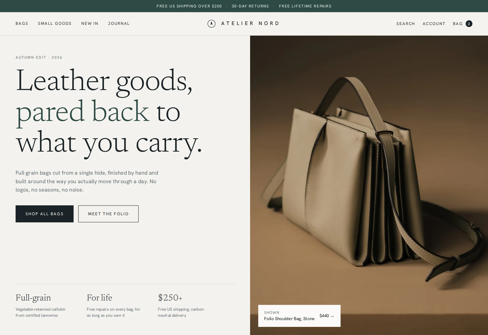

# Atelier Nord

Headless storefront for a Scandinavian-minimal, direct-to-consumer leather bag and small-goods brand.

**Live demo:** https://www.freelancerportfoliohub.com/jameslee/projects/ateliernord/index.html



## Overview

Atelier Nord makes full-grain leather bags and small goods, designed in Minneapolis and sold only through
its own site. The storefront is organised around product families and colourways: one bag in seven colours is
one product with seven variants, merchandised as individual tiles in the grid and switchable inline on the
product page. Every decision point repeats the same promises — free US shipping over $250, 30-day returns and
free lifetime repairs.

All catalog and cart access goes through a typed `Storefront` interface (`lib/commerce/types.ts`). The app
ships with an in-memory implementation backed by `lib/data/`, so merchandisers can add a colourway or launch a
limited run by editing catalog data, and a hosted commerce backend can be plugged in behind the same interface.

## Features

- **Collection pages** – `/collections/[handle]` with a category chip rail, faceted filters (colour, leather,
  size, price, features, availability) with live counts, sort, 3/4-column view, an editorial promo tile and
  load-more pagination.
- **Product pages** – `/products/[handle]` with a packshot + lifestyle gallery (snap carousel on mobile),
  inline colour switching synced to `?color=`, strap selection, pay-in-4 pricing, dispatch cut-off messaging,
  spec accordions, cross-sells, review summary and a sticky mobile add-to-bag bar.
- **Cart** – cookie-backed cart via `/api/cart` and a React context provider: quantity steppers, free-shipping
  progress, gift wrap, promo codes, order summary and hand-off to hosted checkout.
- **Product-family catalog** – colourway-level badges (“Low stock”, “New color”), stock and pre-order states,
  and fallbacks for colourways without photography.
- **Search** and **help pages** (shipping, returns, repairs, care) from typed content.
- **SEO** – per-route metadata, `ProductGroup` JSON-LD, sitemap and redirects from the legacy `.html` URLs.

## Tech stack

- [Next.js 15](https://nextjs.org/) App Router, React 19 Server Components
- TypeScript (strict)
- zod for API validation
- Hand-written CSS with design tokens (`app/globals.css`); self-hosted Newsreader and Nord Sans via `next/font/local`

## Getting started

```bash
pnpm install
cp .env.example .env.local
pnpm dev
```

Open http://localhost:3000.

### Environment variables

| Variable                   | Required | Description                                                 |
| -------------------------- | -------- | ----------------------------------------------------------- |
| `NEXT_PUBLIC_SITE_URL`     | No       | Canonical storefront URL for metadata, JSON-LD and sitemap. |
| `NEXT_PUBLIC_CHECKOUT_URL` | No       | Hosted checkout the cart hands off to (`?cart=<id>`).       |
| `NEWSLETTER_WEBHOOK_URL`   | No       | Receives Nord letter sign-ups. Logged to stdout when unset. |

## Architecture

```
Server components ──► storefront (lib/commerce) ──► Storefront interface ──► mock implementation (lib/data)
Client components ──► CartProvider ──► /api/cart ──► storefront cart methods (cart id in an httpOnly cookie)
```

- `lib/commerce/types.ts` — `Product`, `ProductVariant`, `Collection`, `Cart`, `Money` and the `Storefront` interface.
- `lib/commerce/catalog.ts` — variant lookup, image fallbacks, card swatches, availability labels.
- `lib/commerce/shipping.ts` — free-shipping threshold, pay-in-4 and order summary maths.
- `lib/filters.ts` — pure facet filtering, per-facet counts and sorting used by the collection browser.

## Project structure

```
app/
  api/cart/             cart route handler (GET/POST/PATCH/DELETE)
  api/newsletter/       Nord letter sign-up
  cart/                 bag page
  collections/[handle]/ collection pages
  products/[handle]/    product pages
  pages/[slug]/         help and legal pages
  search/               catalog search
  fonts/                self-hosted woff2 files
components/
  cart/                 CartProvider, line items, summary, promo code, gift wrap
  collection/           chip rail, filter panel, applied filters, collection browser
  home/                 hero, shape tiles, Folio feature, reviews, journal
  layout/               announcement bar, header, footer, newsletter
  product/              product card/grid/rail, gallery, colour picker, sticky add-to-bag
  ui/                   icons, stars, breadcrumbs, section header, promise strip
lib/
  commerce/             storefront interface, mock implementation, money & shipping helpers
  data/                 products, colours, collections, filters, home & site content
public/images/          packshots and editorial photography
```

## Scripts

| Script           | Description                      |
| ---------------- | -------------------------------- |
| `pnpm dev`       | Start the dev server (Turbopack) |
| `pnpm build`     | Production build                 |
| `pnpm start`     | Serve the production build       |
| `pnpm lint`      | ESLint (`next/core-web-vitals`)  |
| `pnpm typecheck` | `tsc --noEmit`                   |
| `pnpm format`    | Format with Prettier             |
